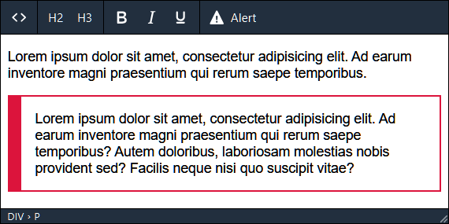

# mce-alert-plugin

Плагин TinyMCE v6 для вставки в текст информационных сообщений.

Такие блоки часто вставляются в документацию или туториал с целью предупредить пользователя
или акцентировать его внимание на какой-то особенности.

Репозиторий для статьи https://delphinpro.ru/a/11
